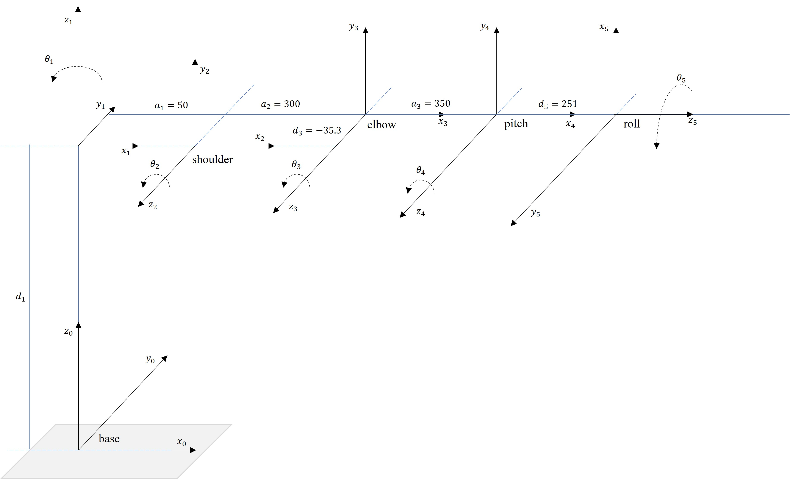
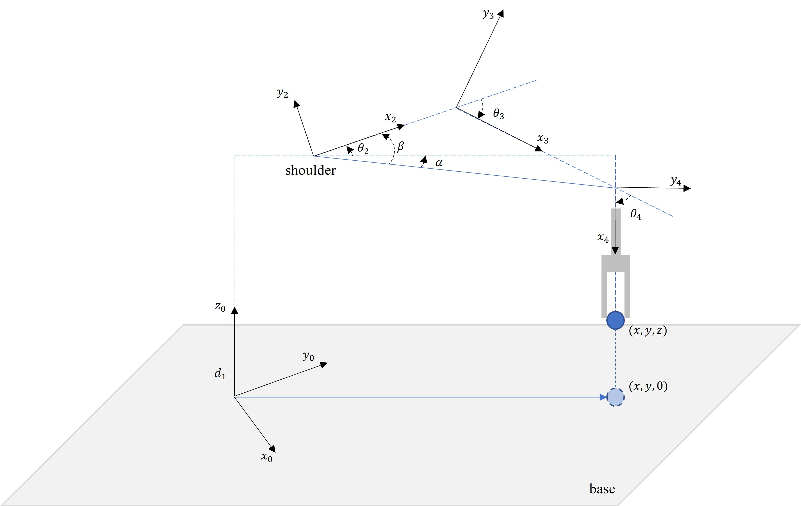
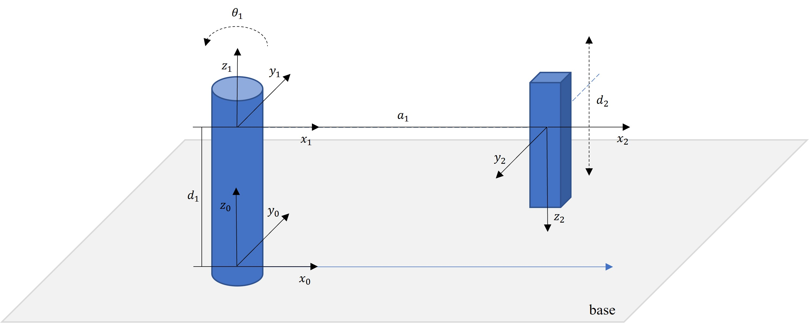

# Assignment-II

Student ID: R11922001. Collaborated with B09902094.

## Part-A I Link-Coordinate Diagram

| Joint | $\alpha_{i-1} \degree$ | $a_{i-1} \mathrm{(mm)}$ | $d_{i} \mathrm{(mm)}$ | $\theta_i (\degree)$ |
| :---: | :--------------------: | :---------------------: | :-------------------: | :------------------: |
|   1   |           0            |            0            |          358          |      $\theta_1$      |
|   2   |           90           |           50            |           0           |      $\theta_2$      |
|   3   |           0            |           300           |         -35.3         |      $\theta_3$      |
|   4   |           0            |           350           |           0           |      $\theta_4$      |
|   5   |           90           |            0            |          251          |      $\theta_5$      |

---

## Part-B Transformation Matrix

Find ${}^{base}_{5}T = {}^{base}_{1}T {}^{1}_{2}T {}^{2}_{3}T {}^{3}_{4}T {}^{4}_{5}T$.

General form of transformation matrix ${}^{i-1}_{i}T$ equals to

$$
{}^{i-1}_{i}T (\alpha_{i-1}, a_{i-1}, d_i, \theta_i)=
\begin{bmatrix}
\cos\theta_i                 & -\sin\theta_i                & 0                 & a_{i-1}                \\
\sin\theta_i\cos\alpha_{i-1} & \cos\theta_i\cos\alpha_{i-1} & -\sin\alpha_{i-1} & -d_i\sin\alpha_{i-1} \\
\sin\theta_i\sin\alpha_{i-1} & \cos\theta_i\sin\alpha_{i-1} & \cos\alpha_{i-1}  & d_i\cos\alpha_{i-1}  \\
0                            & 0                            & 0                 & 1
\end{bmatrix}
$$

Then, the transformation matrices for consecutive links are:

$$
\begin{align*}
{}^{base}_{1}T &= T(0, 0, d_1, \theta_1)
&&=
\begin{bmatrix}
\cos\theta_1 & -\sin\theta_1 & 0 & 0   \\
\sin\theta_1 & \cos\theta_1  & 0 & 0   \\
0            & 0             & 1 & d_1 \\
0            & 0             & 0 & 1
\end{bmatrix} \\
{}^{1}_{2}T &= T(90\degree, 50, 0, \theta_2)
&&=
\begin{bmatrix}
\cos\theta_2  & -\sin\theta_2  & 0  & a_1 \\
0             & 0              & -1 & 0   \\
\sin\theta_2  & \cos\theta_2   & 0  & 0   \\
0             & 0              & 0  & 1
\end{bmatrix} \\
{}^{2}_{3}T &= T(0, 300, d_3, \theta_3)
&&=
\begin{bmatrix}
\cos\theta_3 & -\sin\theta_3 & 0 & a_2 \\
\sin\theta_3 &  \cos\theta_3 & 0 & 0   \\
0            & 0             & 1 & d_3 \\
0            & 0             & 0 & 1
\end{bmatrix} \\
{}^{3}_{4}T &= T(0, 350, 0, \theta_4)
&&=
\begin{bmatrix}
\cos\theta_4 & -\sin\theta_4 & 0 & a_3 \\
\sin\theta_4 &  \cos\theta_4 & 0 & 0   \\
0            & 0             & 1 & 0   \\
0            & 0             & 0 & 1
\end{bmatrix} \\
{}^{4}_{5}T &= T(90\degree, 0, 251, \theta_5)
&&=
\begin{bmatrix}
\cos\theta_5 & -\sin\theta_5 & 0  & 0    \\
0            & 0             & -1 & -d_5 \\
\sin\theta_5 &  \cos\theta_5 & 0  & 0    \\
0            & 0             & 0  & 1
\end{bmatrix}
\end{align*}
$$

Multiply them to get ${}^{base}_{5}T$:

$$
\begin{align*}
{}^{3}_{5}T = {}^{3}_{4}T {}^{4}_{5}T
&=
\begin{bmatrix}
C_4 & -S_4 & 0 & a_3 \\
S_4 &  C_4 & 0 & 0   \\
0   & 0    & 1 & 0   \\
0   & 0    & 0 & 1
\end{bmatrix}
\begin{bmatrix}
C_5 & -S_5 & 0  & 0    \\
0   & 0    & -1 & -d_5 \\
S_5 &  C_5 & 0  & 0    \\
0   & 0    & 0  & 1
\end{bmatrix} \\
&=
\begin{bmatrix}
C_4 C_5 & -C_4 S_5 &  S_4 & S_4 d_5 + a_3 \\
S_4 C_5 & -S_4 S_5 & -C_4 & -C_4 d_5      \\
S_5     & C_5      & 0    & 0             \\
0       & 0        & 0    & 1
\end{bmatrix} \\
{}^{2}_{5}T = {}^{2}_{3}T {}^{3}_{5}T
&=
\begin{bmatrix}
C_3 & -S_3 & 0 & a_2 \\
S_3 &  C_3 & 0 & 0   \\
0   & 0    & 1 & d_3 \\
0   & 0    & 0 & 1
\end{bmatrix}
\begin{bmatrix}
C_4 C_5 & -C_4 S_5 &  S_4 & S_4 d_5 + a_3 \\
S_4 C_5 & -S_4 S_5 & -C_4 & -C_4 d_5      \\
S_5     & C_5      & 0    & 0             \\
0       & 0        & 0    & 1
\end{bmatrix} \\
&=
\begin{bmatrix}
C_{34}C_5 & -C_{34}S_5 &  S_{34} & S_{34} d_5 + C_3 a_3 + a_2 \\
S_{34}C_5 & -S_{34}S_5 & -C_{34} & -C_{34} d_5 + S_3 a_3 \\
S_5       & C_5        & 0       & d_3 \\
0         & 0          & 0       & 1
\end{bmatrix} \\
{}^{1}_{5}T = {}^{1}_{2}T {}^{2}_{5}T
&=
\begin{bmatrix}
C_2 & -S_2 & 0  & a_1 \\
0   & 0    & -1 & 0   \\
S_2 & C_2  & 0  & 0   \\
0   & 0    & 0  & 1
\end{bmatrix}
\begin{bmatrix}
C_{34}C_5 & -C_{34}S_5 &  S_{34} & S_{34} d_5 + C_3 a_3 + a_2  \\
S_{34}C_5 & -S_{34}S_5 & -C_{34} & -C_{34} d_5 + S_3 a_3 \\
S_5       & C_5        & 0       & d_3 \\
0         & 0          & 0       & 1
\end{bmatrix} \\
&=
\begin{bmatrix}
C_{234}C_5  & -C_{234} S_5  & S_{234}  & S_{234} d_5 + C_{23} a_3 + C_2 a_2 + a_1 \\
-S_5        & -C_5          & 0        & -d_3                                \\
S_{234}C_5  & -S_{234} S_5  & -C_{234} & -C_{234} d_5 + S_{23} a_3 + S_2 a_2 \\
0           & 0             & 0        & 1
\end{bmatrix} \\
{}^{base}_{5}T = {}^{base}_{1}T {}^{1}_{5}T
&=
\begin{bmatrix}
C_1 & -S_1 & 0  & 0   \\
S_1 & C_1  & 0  & 0   \\
0   & 0    & 1  & d_1 \\
0   & 0    & 0  & 1
\end{bmatrix}
\begin{bmatrix}
C_{234}C_5  & -C_{234} S_5  & S_{234}  &S_{234} d_5 + C_{23} a_3 + C_2 a_2 + a_1 \\
-S_5        & -C_5          & 0        & -d_3                                \\
S_{234}C_5  & -S_{234} S_5  & -C_{234} & -C_{234} d_5 + S_{23} a_3 + S_2 a_2 \\
0           & 0             & 0        & 1
\end{bmatrix} \\
&=
\begin{bmatrix}
C_{234} (C_1 C_5 + S_1 S_5) & C_{234} (S_1 C_5 - C_1 S_5) & C_1 S_{234} & C_1 (S_{234} d_5 + C_{23} a_3 + C_2 a_2 + a_1) + S_1 d_3 \\
C_{234} (S_1 C_5 - C_1 S_5) & -C_{234} (S_1 S_5 + C_1 C_5) & S_1 S_{234} & S_1 (S_{234} d_5 + C_{23} a_3 + C_2 a_2 + a_1) - C_1 d_3 \\
S_{234}C_5  & -S_{234} S_5  & -C_{234}  & -C_{234} d_5 + S_{23} a_3 + S_2 a_2 + d_1 \\
0           & 0             & 0        & 1
\end{bmatrix}
\end{align*}
$$

---

## Part-C I Inverse Kinematics

Given the last frame's orientation and translation, we can obtain the equation

$$
{}^{base}_{5}T =
\begin{bmatrix}
{}^{0}r_{11} & {}^{0}r_{12} & {}^{0}r_{13} & p_x \\
{}^{0}r_{21} & {}^{0}r_{22} & {}^{0}r_{23} & p_y \\
{}^{0}r_{31} & {}^{0}r_{32} & {}^{0}r_{33} & p_z \\
0            & 0            & 0            & 1
\end{bmatrix}
$$

Recall the inverse transformation, we will use this property to find ${}^{base}_{1}T^{-1}$:

$$
{}^{i+1}_{i}T = ({}^{i}_{i+1}T)^{-1} =
\begin{bmatrix}
    \begin{array}{ccc | c} \\
    & {}^{i}_{i+1}R & & {}^{i}_{i+1}T \\
    \\ \hline
    & 0             & & 1
    \end{array}
\end{bmatrix}^{-1} =
\begin{bmatrix}
    \begin{array}{ccc | c}
    \\
    & {}^{i}_{i+1}R ^ T &  & - {}^{i}_{i+1}R ^ T \cdot {}^{i}_{i+1}T \\
    \\ \hline
    & 0               & & 1
    \end{array}
\end{bmatrix}
$$

Using the equality ${}^{base}_{1}T^{-1} \cdot {}^{base}_{5}T = {}^{1}_{5}T$:

$$
\begin{bmatrix}
C_1  & S_1 & 0 & 0    \\
-S_1 & C_1 & 0 & 0    \\
0    & 0   & 1 & -d_1 \\
0    & 0   & 0 & 1
\end{bmatrix}
\begin{bmatrix}
{}^{0}r_{11} & {}^{0}r_{12} & {}^{0}r_{13} & p_x \\
{}^{0}r_{21} & {}^{0}r_{22} & {}^{0}r_{23} & p_y \\
{}^{0}r_{31} & {}^{0}r_{32} & {}^{0}r_{33} & p_z \\
0            & 0            & 0            & 1
\end{bmatrix} =
\begin{bmatrix}
C_{234}C_5  & -C_{234} S_5  & S_{234}  & S_{234} d_5 + C_{23} a_3 + C_2 a_2 + a_1 \\
-S_5        & -C_5          & 0        & -d_3                                \\
S_{234}C_5  & -S_{234} S_5  & -C_{234} & -C_{234} d_5 + S_{23} a_3 + S_2 a_2 \\
0           & 0             & 0        & 1
\end{bmatrix}
$$

Representing $p_x$ and $p_y$ in cylindrical coordinate system:

$$
(p_x, p_y) = (\rho \cos \phi, \rho \sin \phi) \iff
(\rho, \phi) = (\sqrt{p_x^2 + p_y^2}, \arctan(\frac{p_y}{p_x}))
$$

Check the element $(2, 4)$, we can obtain the constraint of $\theta_1$:

$$
\begin{align*}
-\sin\theta_1 p_x + \cos\theta_1 p_y &= -d_3 \\
\rho \sin(\phi - \theta_1)           &= -d_3 \\
\sin(\phi - \theta_1)                &= -\frac{d_3}{\rho} \\
\cos(\phi - \theta_1)                &= \sqrt{1-(\frac{d_3}{\rho})^2} \\
\tan(\phi - \theta_1)                &= \frac{-d_3}{\sqrt{\rho ^2 - d_3^2}} \\
\theta_1 &= \arctan(\frac{p_y}{p_x}) - \arctan(\frac{-d_3}{\sqrt{\rho ^2 - d_3^2}})
\end{align*}
$$

Find $\theta_2$ and $\theta_3$ by the law of cosines and Pythagorean theorem. Notes that we assume the arm is operating in elbow-up configuration, which applies $\theta_3 \le 0$.

$$
\begin{align*}
a_2^2 + a_3^2 - 2 a_2 a_3 \cos (\pi - \theta_3) &= (\sqrt{p_x^2 + p_y^2} - a_1) ^ 2 + (d_1 - d_5 - p_z) ^ 2 \\
\cos \theta_3 &= \frac{(\sqrt{p_x^2 + p_y^2} - a_1) ^ 2 + (d_1 - d_5 - p_z) ^ 2 - a_2^2 - a_3^2}{2 a_2 a_3} \\
\theta_3 &= -\arccos (\frac{(\sqrt{p_x^2 + p_y^2} - a_1) ^ 2 + (d_1 - d_5 - p_z) ^ 2 - a_2^2 - a_3^2}{2 a_2 a_3}) \\
\tan \alpha &= \frac{p_z - d_1 - d_5}{\sqrt{p_x^2 + p_y^2} - a_1} \\
\tan \beta &= \frac{a_3 \sin \theta_3}{a_2 + a_3 \cos \theta_3} \\
\theta_2 &= \alpha - \beta
\end{align*}
$$

Because the gripper is vertical downward, $\theta_4 = -\theta_2 - \theta_3$. Given $\theta_2$ and $\theta_3$, $\theta_4$ can be figured out.

---

## Part-C II Inverse Kinematics

Recall the ZYX Euler angle representation and inverse kinematics we found in Part-C I:

$$
\begin{align*}
R(\phi, \theta, \psi) &=
\begin{bmatrix}
C_\phi & -S_\phi & 0 \\
S_\phi &  C_\phi & 0 \\
0      & 0       & 1
\end{bmatrix} \cdot \begin{bmatrix}
C_\theta & 0 & S_\theta \\
0        & 1 & 0         \\
-S_\theta & 0 & C_\theta
\end{bmatrix} \cdot \begin{bmatrix}
1 & 0      & 0    \\
0 & C_\psi & -S_\psi \\
0 & S_\psi & C_\psi
\end{bmatrix} \\
&= \begin{bmatrix}
C_\phi C_\theta & -S_\phi C_\psi + C_\phi S_\theta S_\psi & S_\phi S_\psi + C_\phi S_\theta C_\psi \\
S_\phi C_\theta &  C_\phi C_\psi + S_\phi S_\theta S_\psi & -C_\phi S_\psi + S_\phi S_\theta C_\psi\\
-S_\theta       &  C_\theta S_\psi                        & C_\theta C_\psi
\end{bmatrix}
\end{align*}
$$

$$
\begin{align}
\theta_1 &= \arctan(\frac{p_y}{p_x}) - \arctan(\frac{-d_3}{\sqrt{p_x^2 + p_y^2 - d_3 ^2}}) \\
\theta_2 &= \arctan(\frac{p_z - d_1 - d_5}{\sqrt{p_x^2 + p_y^2} - a_1}) - \arctan(\frac{a_3 \sin \theta_3}{a_2 + a_3 \cos \theta_3}) \\
\theta_3 &= \arccos (\frac{(\sqrt{(p_x^2) + (p_y^2)} - a_1) ^ 2 + (d_1 - d_5 - p_z) ^ 2 - a_2^2 - a_3^2}{2 a_2 a_3}) \\
\theta_4 &= - \theta_2 - \theta_3
\end{align}
$$

The transformation matrix:

$$
{}^{i-1}_{i}T =
\begin{bmatrix}
    \begin{array}{ccc | c} \\
    & {}^{i-1}_{i}R & & {}^{i-1}_{i}T \\
    \\ \hline
    & 0             & & 1
    \end{array}
\end{bmatrix}
$$

Solution:

|  No.  | $\theta_1 (\degree)$ | $\theta_2 (\degree)$ | $\theta_3 (\degree)$ | $\theta_4 (\degree)$ | $\theta_5 (\degree)$ |
| :---: | :------------------: | :------------------: | :------------------: | :------------------: | :------------------: |
|   1   |         6.09         |        20.71         |        -58.21        |        37.50         |        -38.86        |
|   2   |         6.13         |        27.16         |        -60.81        |        33.65         |        -38.86        |
|   3   |         6.14         |        20.71         |        -58.21        |        37.50         |        -51.13        |

Notes:

* I found the value $\theta_5$ by inverting ${}^{base}_{4}T$ and multiply with target frame. Then, check the answer match the form of ${}^{4}_{5}T$, calculate arcsin() or arccos() for the elements in rotation matrix. The answer is not analytical but at least empirically work?

---

## Part D Bonus

| Joint | $\alpha_{i-1} (\degree)$ | $a_{i-1} \mathrm{(mm)}$ | $d_{i} \mathrm{(mm)}$ | $\theta_i (\degree)$ |
| :---: | :----------------------: | :---------------------: | :-------------------: | :------------------: |
|   1   |            0             |            0            |         $d_1$         |      $\theta_1$      |
|   2   |           180            |          $a_1$          |         $d_2$         |          0           |

* $\theta_1$ and $d_2$ are varying parameters. Others are fixed parameters.

## Reference

1. Laurenţiu Predescu, Ion Stroe, "ON THE KINEMATICS OF THE SCORBOT ER-VII ROBOT"